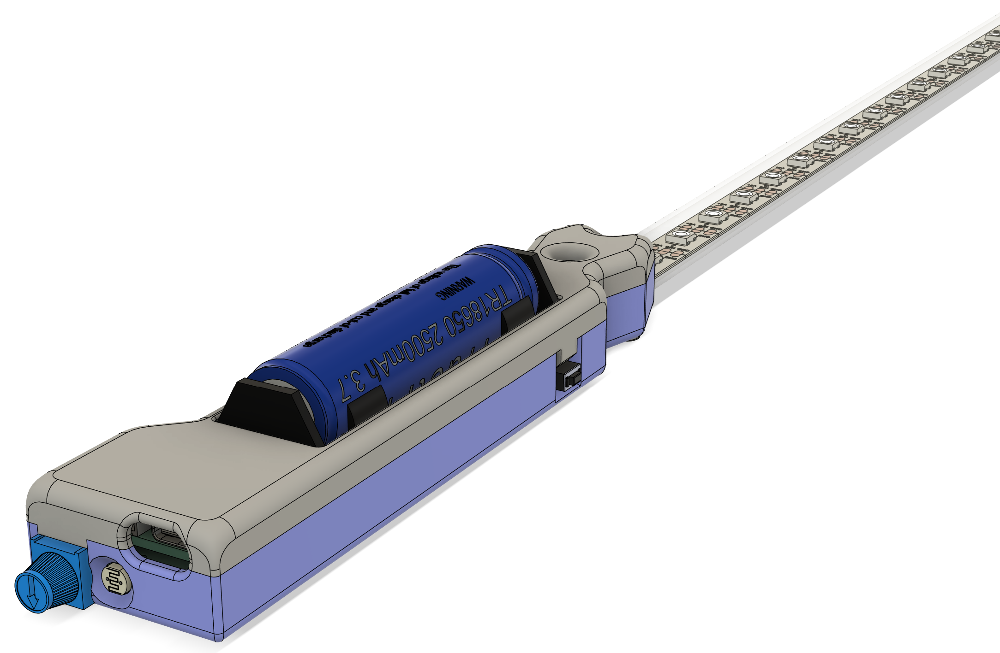

# Lightsaber

## Pinout of the wemos c3 pico

| Function          | Pin |
|-------------------|----:|
| Neopixelstrip     |   2 |
| Mode button       |   5 |
| Internal RGB*     |   7 |
| Potentiometer     |   1 |
| Batteryvoltage**  |   3 |
| Ambient light     |   0 |

\* This is a GRB instead of RGB LED
\** This requires a solder jumper on the back of the C3 board
